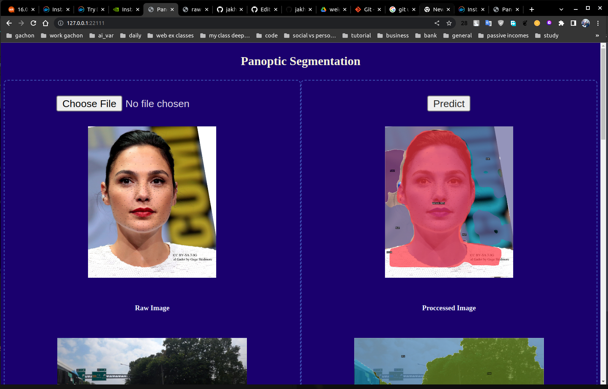

# Web Detectron2 Flask App Dockerized
<p float="left">
  
<!--   
 -->
</p>


This repository contains a Dockerized Flask application that uses the Detectron2 library for object detection tasks.

## Getting Started

These instructions will get you a copy of the project up and running on your local machine for development and testing purposes.

### Prerequisites

What things you need to install the software and how to install them:

```bash
Python >= 3.8
pytorch >= 1.13.1+cu116

```
download trained panoptic segmentation weights and extract and palce it in folder "Segmentation" 
```
wget https://drive.google.com/file/d/1imeNAfXMeq05mw0mJ8hpTO950Y8dvHGt/view?usp=sharing
```
or
link: <a href="https://drive.google.com/file/d/1imeNAfXMeq05mw0mJ8hpTO950Y8dvHGt/view?usp=sharing">model_final_cafdb1.pkl</a> 


folder structure: 
```
  -Segmentation
  --weights
  ---model_final_cafdb1.pkl

```

### Installing locally 
- developed in linux ubuntu enviorenment
- docker is recommended instead of building locally
```bash
pip install virtualenv

virtualenv my_env

source my_env/bin/activate

 pip3 install torch torchvision torchaudio --extra-index-url https://download.pytorch.org/whl/cu116

 Install the required packages
 pip install --no-cache-dir -r requirements.txt

 git clone https://github.com/facebookresearch/detectron2.git
 python -m pip install -e detectron2

 apt-get update && apt-get install -y libgl1-mesa-glx

```

### Docker & Deployment 
* create image and run it on container 
* access it on you web browser 


```bash
docker-compose up

http://127.0.0.1:22111/

```

### Built With
* Flask - The web framework used
* Detectron2 - Object detection library
* Docker - Containerization platform

### Contributing
all open 

### Authors
* Jakhongir Nodirov - Main Developer - jakhon37

### License
This project is licensed under the MIT License - see the LICENSE.md file for details

Acknowledgments
detectron2
